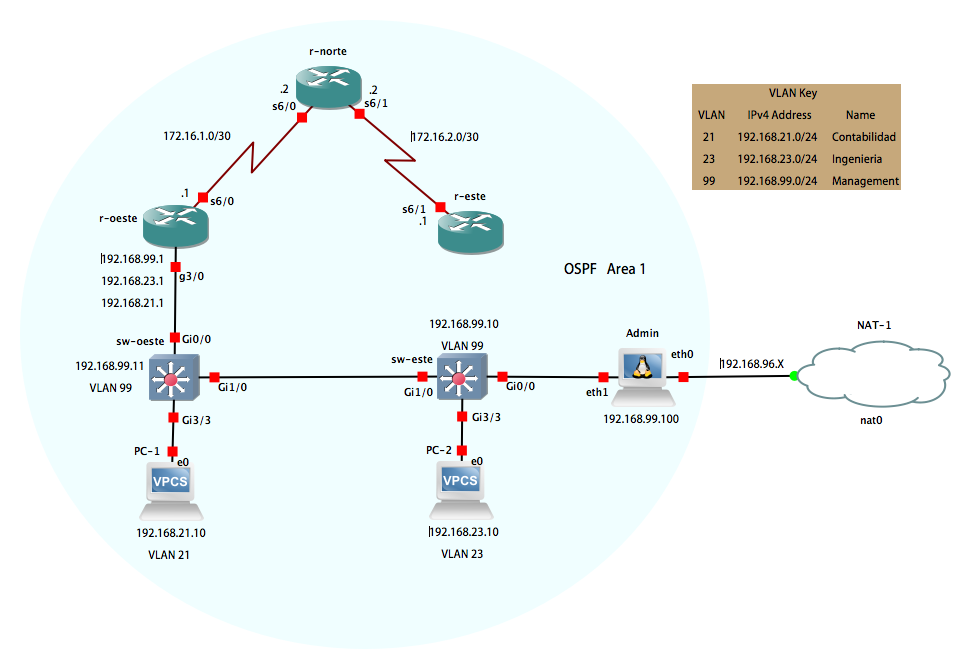

# CCNA: Routing and Switching Essentials

## Skills Assessment - Student Training  

En esta practica vamos a realizar la configuracion de una red simple para
que que pueda tener conexion con IPv4, switch security, inter VLAN routing,
OSPF.
Los pasos serian los siguientes:

- Part 1: Initialize Devices  
- Part 2: Configure Device Basic Settings  
- Part 3: Configure Switch Security, VLANs, and Inter-VLAN Routing   
- Part 4: Configure OSPF  

Despues de hacer las 4 partes vamos a implementar la practica con los siguientes pasos:

- Part 5: Implement DHCP and NAT for IPv4  
- Part 6: Configure NTP  

Para la realizacion de la practica hemos usado la herramienta GNS3 y los
dispositivos usados son los siguientes:
- Router: Cisco C7200 (c7200-adventerprisek9-mz.152-4.M7.image)
- Switch: CiscoIOSvL2 (vios_l2-adventerprisek9-m.vmdk.SSA.152-4.0.55.E)
- NetworkAutomation GNS3 (Sistema operativo Ubuntu + extras (Ansible, Paramiko...)

Dado que son imagenes simuladas de sistemas operativos de *CISCO*, pueden 
fallar/faltar algunos comandos, pero salvo error en la descarga esta todo lo necesario.

Para poder realizar toda la orquestacion/automatizacion mediante **ANSIBLE**, debemos
tener una configuracion inicial en los dispositivos *CISCO* descritos anteriormente o 
introducir manualmente la configuracion inicial segun la necesidad o los requirimientos 
de la practica.

La configuracion inicial necesaria para cada dispositivo esta en la carpeta 
"Initial Setup"

#Steps to follow in order to make a good configuration:

##1-º Configure the Network Automation:

###Configure the interfaces:

 auto eth0
 iface eth0 inet dhcp
 auto eth1
 iface eth1 inet static
 address 192.168.99.100
 netmask 255.255.255.0
 gateway 192.168.99.1
  
### Configure */etc/hosts*:

 192.168.99.10 sw-este
 192.168.99.11 sw-oeste
 192.168.99.1 r-oeste
 172.16.1.2 r-norte
 172.16.2.1 r-este

### We have to give root permission to ssh:
 chown root /root/.ssh/config

### To can reach Internet and the local lan we have to define a static route and delete another one:
 route add -net 172.16.0.0/16 dev eth1
 route del -net 0.0.0.0/0 gw 192.168.99.1

##2-º Configure Ansible 

We have to create this two files in order not to overwrite the original files.

root@Admin:~# cat *hosts* 

[switch]
sw-este
sw-oeste
[router]
r-oeste
r-norte
r-este

root@Admin:~# cat *ansible.cfg* 

[defaults]
inventory = hosts
become_method = enable
host_key_checking = false
gather_facts = false
timeout = 100
remote_user = ansible

##3-º Apply the basic configuration for SW-ESTE, which you will find it in “Initial setup” folder.

##4-º With the next commands we are going to execute the playbook for the SW-ESTE role.

 ansible-playbook -i  hosts roles/config_sw_este/tasks/create_vlan.yml –k –u ansible
 ansible-playbook -i  hosts roles/config_sw_este/tasks/config_vlan.yml –k –u ansible

With this two simple commands we have configured the sw-este, now we are going to configure sw-oeste.

##5-º Apply the basic configuration for SW-OESTE, which you will find it in “Initial setup” folder.

##6-º With the next commands we are going to execute the playbook for the SW-OESTE role.

 ansible-playbook -i  hosts roles/config_sw_oeste/tasks/create_vlan.yml –k –u ansible
 ansible-playbook -i  hosts roles/config_sw_oeste/tasks/config_vlan.yml –k –u ansible

Once we have finished the configuration for sw-oeste, we will continue with r-oeste.

##7-º Apply the basic configuration for R-OESTE, which you will find it in “Initial setup” folder.

After we apply the basic configuration, we have to type manually “write memory” on the route in order to will be able to save automatically the configuration after.

##8-º With the next commands we are going to execute the playbook for the R-OESTE role.

 ansible-playbook -i  hosts roles/config_r_oeste/tasks/config_interfaces.yml –k –u ansible
 ansible-playbook -i  hosts roles/config_r_oeste/tasks/config_subinterfaces.yml –k –u ansible
 ansible-playbook -i  hosts roles/config_r_oeste/tasks/config_ospf.yml –k –u ansible

We are going to do steps 7 and 8 for all the routers that we have in our network minus the role “config_subinterfaces.yml because in router NORTE and ESTE we don’t have VLAN.

##9-º Apply the basic configuration for R-NORTE, which you will find it in “Initial setup” folder.

After we apply the basic configuration, we have to type manually “write memory” on the route in order to will be able to save automatically the configuration after.

##10-º With the next commands we are going to execute the playbook for the R-NORTE role.

 ansible-playbook -i  hosts roles/config_r_norte/tasks/config_interfaces.yml –k –u ansible
 ansible-playbook -i  hosts roles/config_r_norte/tasks/config_ospf.yml –k –u ansible

##11-º Apply the basic configuration for R-ESTE, which you will find it in “Initial setup” folder.

After we apply the basic configuration, we have to type manually “write memory” on the route in order to will be able to save automatically the configuration after.

With the basic configuration, we have enough for R-ESTE so far.

